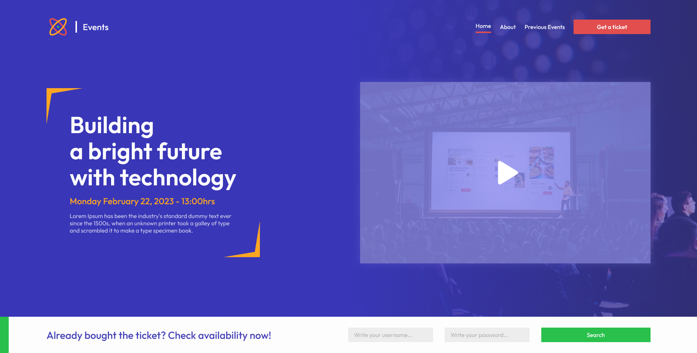

# Events

The "Events" project is a web application developed using Tailwind CSS, React Router DOM, and custom hooks to abstract repetitive logic. With a focus on providing an excellent user experience across various devices, the project is fully responsive, adapting seamlessly to screens of all sizes.

The utilization of Tailwind CSS enabled swift and customized styling, resulting in a unique and pleasant design. Additionally, the integration of React Router DOM facilitated smooth navigation between different application pages.

## How to run the projetct?

If you want to clone this repository on your machine, make sure you have Node.js installed and then run the following command in the terminal:

<pre>https://github.com/adriel-mp3/events.git</pre>

Install the project's dependencies by running the command:

<pre>npm install</pre>

After installing the dependencies, start the application with the following command:

<pre>npm run dev</pre>

  

## Built With

- Vite
- React.js
- React Router Dom
- Tailwind CSS
